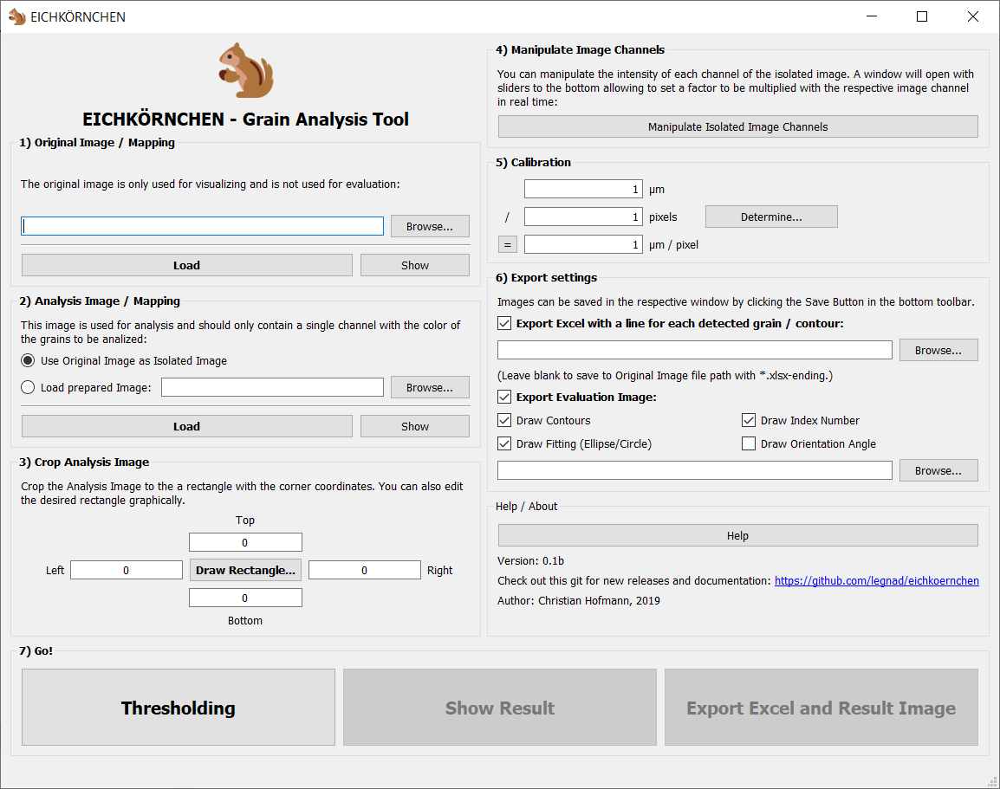

# EICHKÖRNCHEN - Grain Analysis Tool
This tool allows you to analyse images or mappings for grain sizes and orientation.

Thresholding:

Check the results:

Export to Spreadsheet (xlsx) - one grain per line:

A detailed documentation is pending.

## INSTALLATION

### Windows: 

1) Install Python 3 including pip and tkinter. 

2) Download latest release and unzip: [https://github.com/legnad/eichkoernchen/blob/master/eichk%C3%B6rnchen_0.1bi.zip](https://github.com/legnad/eichkoernchen/blob/master/eichk%C3%B6rnchen_0.1bi.zip)

3) Run the "install_modules.py" file to install dependencies. 

4) Start the Program by starting "eichkörnchen.py".
